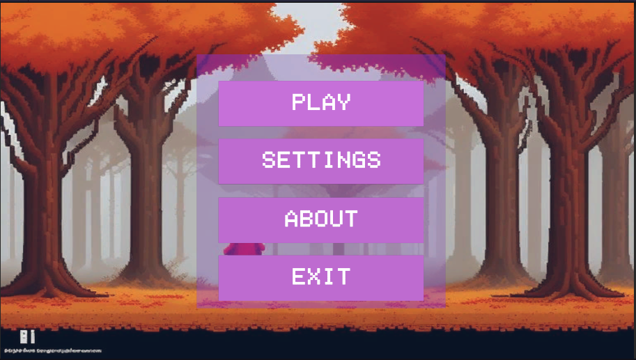
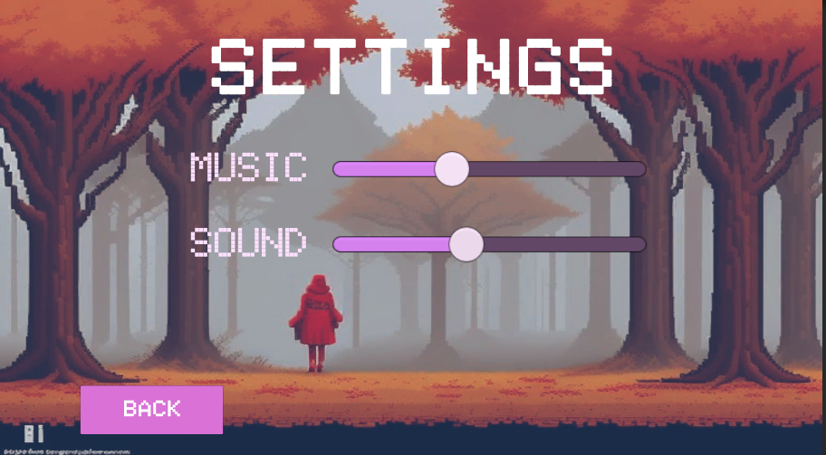
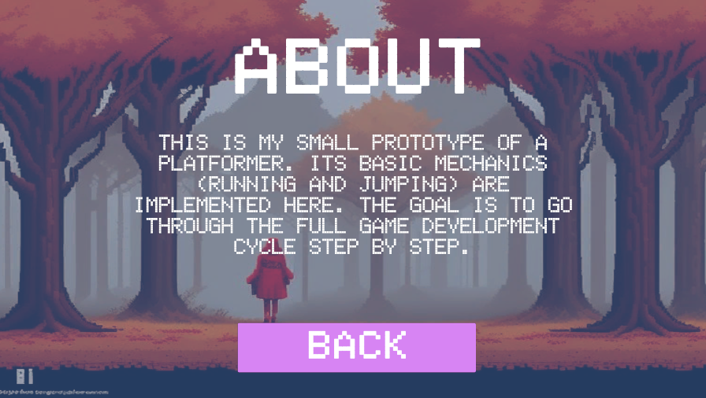
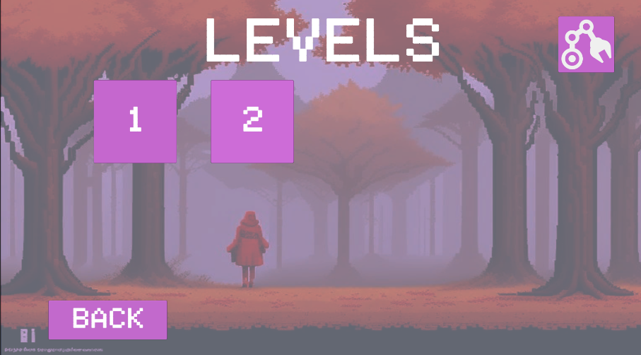
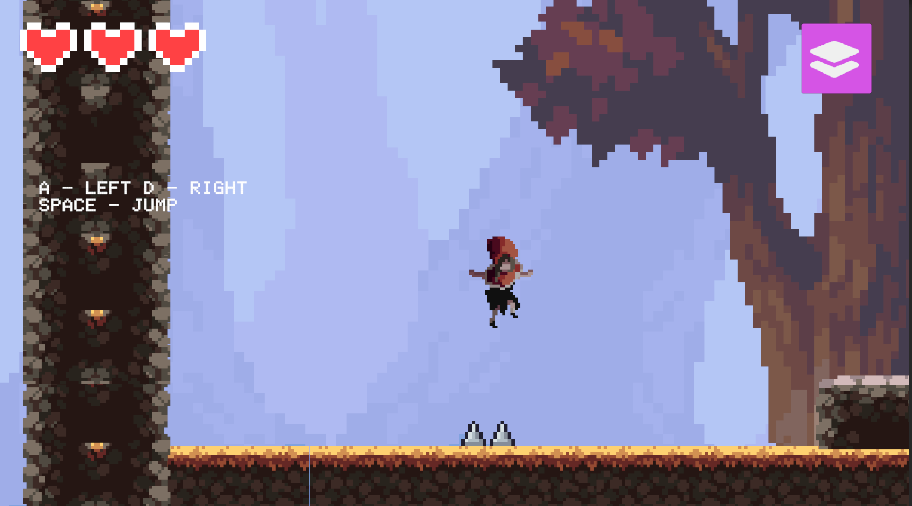
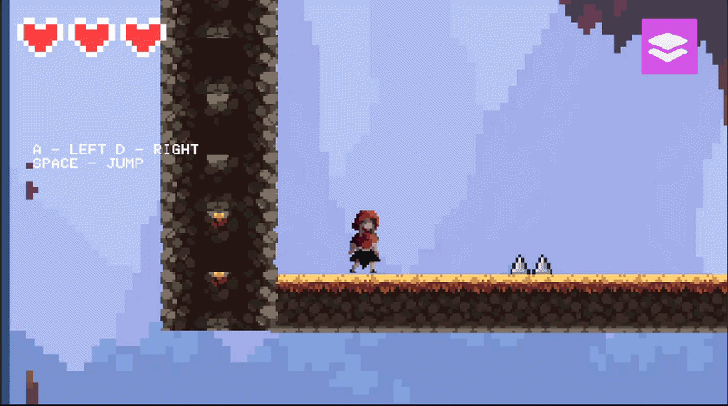
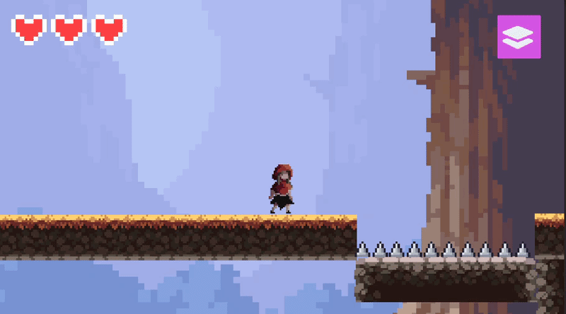
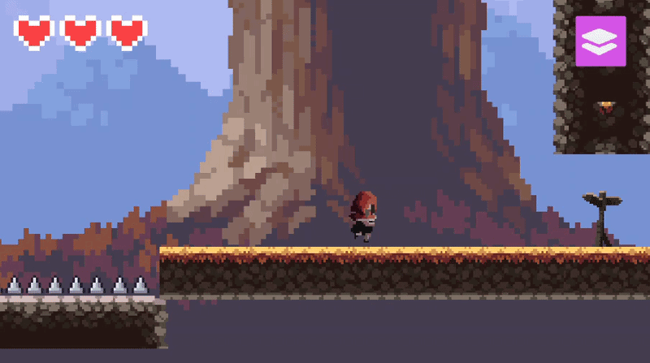
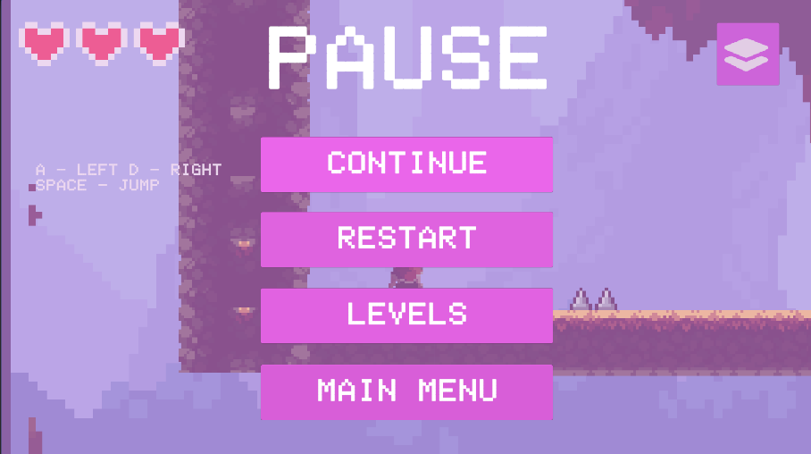

#🕹️ 2D Pixel-Art Platformer

A classic side-scrolling platformer built with Unity 2D. This project focuses on clean character controller logic, level state management, and audio integration.

🚀 Key Features

- Smooth Character Controller: Responsive movement (Left/Right) and a tuned Jump mechanic.

- Health & Damage System: Implementation of player vulnerability, damage spikes, and a "Game Over" state.

- Audio Engine: Integrated background music (BGM) and spatial sound effects (SFX) for an immersive experience.

- Pixel-Art Aesthetics: Clean retro-style visuals with optimized sprite rendering.

🎮 Gameplay - with GIF and images

- Main Menu
  

- Settings
  

- About
  

- Levels
  

- First Level
  

- Moving
  

- Game Over
  

- Win
  

- Pause
  

